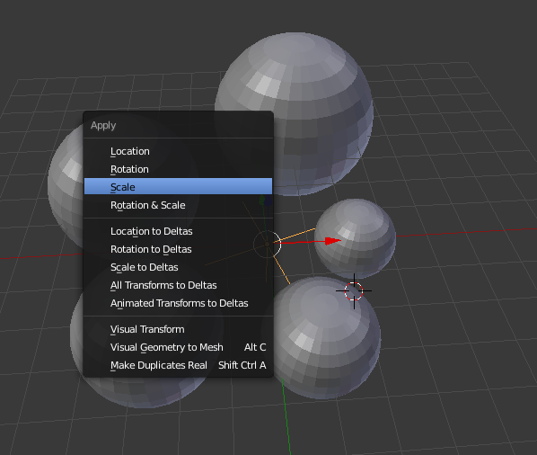

# Array

If the cursor has been moved, hit Shift + s to move the cursor to the center.

Then add a mesh object with Shift + a.

Then use Shift + a to add an empty &gt; plain axis.

There will be a black cross in the same position as the sphere, so it may be hard to see.

Move mesh object along the X axis \(red line\) so it's not in the center.

In the left menu, go to Set Origin &gt; Origin to 3D Cursor, so the origin \(little yellow dot\) is back in the center.

If you don't see the left menu, hit t to open/close it.

Make sure the mesh object is still selected, then choose the Array modifier.

In the Array modifier, change these settings:

* Count: 5
* Deselect Relative Offset
* Select Constant Offset
* Select axis for Object Offset \(either with the eye dropper tool or the drop-down\)

You may see the object multiply while you adjust the settings, then disappear. That's normal! The object clones are all there, they're just in the same spot as the first object.

Select the axis and rotate it on the Z axis using r + z.

You'll see the clone objects moving along while the axis rotates. Click to keep the axis in this position.

Hit 7 to view your objects from the top view.

Hit 5 to be in orthographic mode \(check which mode you're in by looking at the top left of the viewpoint\).

If you need to go back into user perspective, just hit 5 again.

In the image below, I rotated the axis more just so the objects were about an even distance from each other.

If you wish to move the objects in a symmetrical way, put the object in edit mode \(hit tab to enter/leave edit mode\).

Use a to select the whole mesh.

Then move it along the X axis \(g + x\) to see the other objects move closer or farther from the center.

You can also lift the object with g + z to raise them all at the same level.

If you want to move them in a "raised curve" sort of position \(like a stairwell\), you need to exit edit mode and select the empty axis.

Raise the axis on the Z axis using g + z.

This is only an introduction to what the array modifier can be used for. 

Some other examples can be:

* Books on a shelf
* Stairs \(either in a curved position or a straight up stairwell\)
* Train cars
* Beads on a necklace

Keep in mind that objects created in the Array modifier follow a specific pattern to where they're positioned and not randomly \(like stars or sprinkles\).

The particles option in Blender can be used to create randomly placed objects if that's what you're trying to do.

### Possible Issues

Sometime you may notice a weird scaling or rotation issue happen when using the empty axis on the objects.

I created the bottom image by sizing the axis using s and moving the cursor.

 You can remedy that by selecting ctrl + a to fix rotation and/or scale.

Now all of the objects are their original size again.

