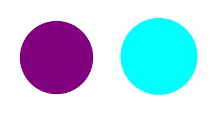
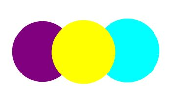
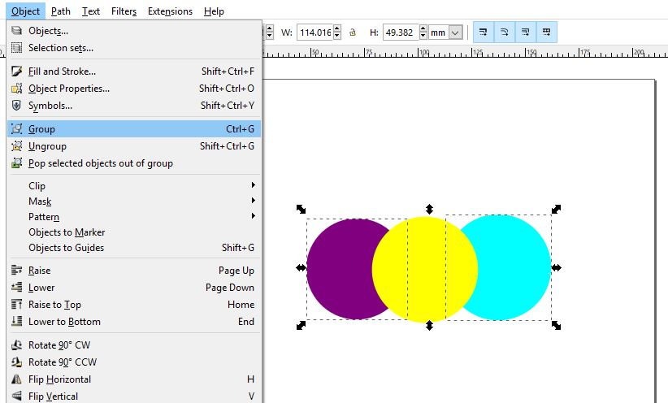
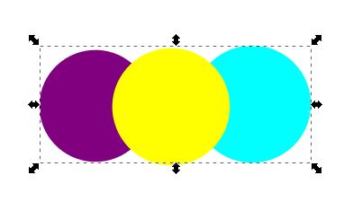
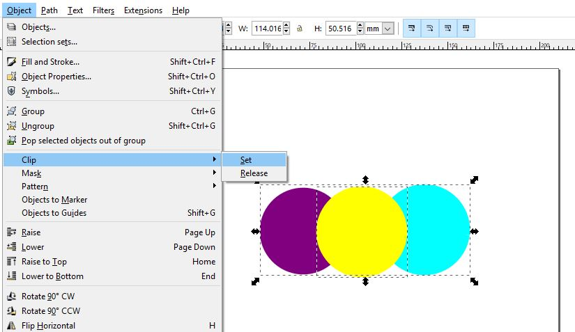
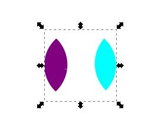
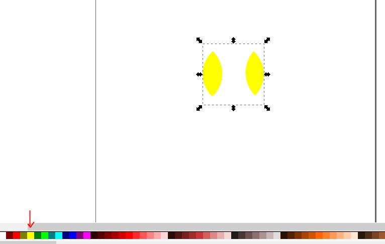
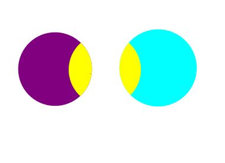

# Clipping

I found that when clipping, the object\(s\) underneath the one being clipped disappear. Sometimes you may not want that so I included that scenario in this example.

This process will require 2 layers.

On layer 1,  include the object\(s\) that will go below the object being clipped. Lock this layer with the padlock symbol so you don't accidentally edit the shapes. Also, hide it by clicking the eye symbol to avoid confusion.

To create layer 2, duplicate layer 1 so it contains the same objects. Than add the shape that will be clipped in this layer. Keep this layer unlocked.

Still on layer 2, select the object\(s\) you duplicated from layer 1. You can select multiple objects at once by holding down shift.

Then select Object &gt; Group, to group them together. This allows you to click on either object to select the other.

The selection will look like this afterwards. Keep in mind the yellow circle is NOT part of the selection.

Now select the yellow circle by holding down shift so both the group and object you're going to clip will be selected.

Choose Object &gt; Clip &gt; Set, to clip it.

Once that's clipped, you'll see the remaining parts of the yellow circle only where it overlapped with the purple and blue ones. You'll also see that it set the circle pieces with the same color as them.

If you ever wanted to undo this, just go to Object &gt; Clip &gt; Release, to revert back.

You can set it back to its initial color by selecting the color at the bottom of the page. Click the color, then hold down shift and click the color again to turn the border the same color.

Go back to layer 1 and click the eye to make the layer visible so it appears below the clipped object. Then you're done!

