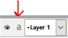
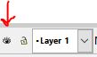

# Layers

## Lock

Click on the padlock symbol to lock and unlock the layer. This keeps the objects in this layer from being selected when visible.

## Hide

Click on the eye symbol to make the layer hidden and visible. This can be useful if you want to avoid clutter when a layer isn't in use.

## New

## Duplicate

